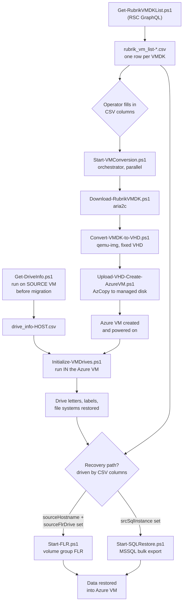

# VMware to Azure Mass Recovery - Overview

End-to-end toolkit for recovering VMware VMs from Rubrik into Azure as native
Azure VMs, then rebuilding in-guest drive layout and restoring application data.

The whole workflow is driven by CSV files. You generate a CSV, fill in a small
number of columns, and each script reads the columns relevant to its phase.

## The three phases

| Phase | What it does | Where it runs |
|---|---|---|
| 1. Conversion | Download VMDKs from Rubrik, convert to fixed VHD, upload to Azure as managed disks, create the Azure VM | Staging Windows host with Hyper-V role |
| 2. Drive rebuild | Recreate partitions, file systems, labels and drive letters on raw disks inside the new Azure VM | Source VM (capture) then target Azure VM (apply) |
| 3. Data recovery | Restore application data via file-level recovery (FLR) or MSSQL bulk export | Any host with RSC access |

Phase 3 branches: a given server goes down the **FLR path**, the **SQL path**, or
both. The branch is selected purely by which CSV columns you fill in.

## There are two CSVs, not one

This is the single most common point of confusion. They are produced by
different scripts, have different schemas, and are consumed by different phases.

| CSV | Produced by | Row granularity | Drives |
|---|---|---|---|
| `rubrik_vm_list-<timestamp>.csv` | `Get-RubrikVMDKList.ps1` | One row per **VMDK** | Phase 1 and Phase 3 |
| `drive_info-<COMPUTERNAME>.csv` | `Get-DriveInfo.ps1` | One row per **volume with a drive letter** | Phase 2 only |

The VM list CSV is the master control file. The drive info CSV is a per-server
capture of the source VM's disk layout, taken before migration.

See [04-csv-reference.md](04-csv-reference.md) for every column in both files.

## End-to-end flow

## Script inventory

### Phase 1 - Conversion

| Script | Role |
|---|---|
| `Get-RubrikVMDKList.ps1` | Generates the master VM list CSV from RSC. Merges forward your edits on re-run. |
| `Start-VMConversion.ps1` | **Orchestrator.** Groups VMDKs by VM, runs N VMs in parallel through download/convert/upload, tracks state for resume and retry. |
| `Download-RubrikVMDK.ps1` | Called by the orchestrator. Triggers and downloads VMDKs via aria2c. |
| `Convert-VMDK-to-VHD.ps1` | Called by the orchestrator. qemu-img conversion to fixed VHD, alignment, boot disk and partition style detection. |
| `Upload-VHD-Create-AzureVM.ps1` | Called by the orchestrator. AzCopy upload to a managed disk. Can also create a VM standalone. |
| `conversion_config.psd1` | Shared pipeline settings (paths, throttle, Azure subscription and region). |
| `upload_config.psd1` | Only needed for standalone manual uploads, not for the orchestrated flow. |

### Phase 2 - Drive rebuild

| Script | Role |
|---|---|
| `Get-DriveInfo.ps1` | Run on the **source** VM before migration. Captures volume, partition and disk layout to CSV. |
| `Initialize-VMDrives.ps1` | Run **inside** the target Azure VM after first boot. Matches raw disks to the captured CSV and initializes them. |

### Phase 3 - Data recovery

| Script | Role |
|---|---|
| `Start-FLR.ps1` | **Use this one.** Orchestrates volume group file-level recovery with state tracking, resume and status checking. |
| `Start-SQLRestore.ps1` | Orchestrates MSSQL bulk database export with state tracking, resume and status checking. |
| `Invoke-FLR.ps1` | Earlier single-shot FLR script with no state tracking. Superseded by `Start-FLR.ps1`. |

### Legacy

| Script | Note |
|---|---|
| `Main-Conversion-Script.ps1` | Original serial wrapper. Reads the `Notes` column instead of `Convert`, no parallelism, no state tracking. Superseded by `Start-VMConversion.ps1`. |

## Design principles worth knowing

**Every orchestrator is resumable.** `Start-VMConversion`, `Start-FLR` and
`Start-SQLRestore` each write a state CSV to the working directory. Re-running
the script skips work that already completed. Failed items are skipped unless
you pass `-RetryFailed`.

**Phase 1 is idempotent at the Azure resource level.** If a managed disk, NIC or
VM already exists with the expected name, it is reused rather than recreated.

**Phase 3 is fire and forget.** Both `Start-FLR` and `Start-SQLRestore` initiate
the job, record the async request ID, and exit. Run again (or with `-CheckOnly`)
to poll status.

**Your CSV edits survive regeneration.** Re-running `Get-RubrikVMDKList.ps1`
finds the most recent CSV matching the prefix and merges your edited columns
forward, keyed on `vmdkFile` + `Cluster`. Use `-SkipMerge` to start clean.

## Next

- [05-prereqs.md](05-prereqs.md) - what to install and set up first
- [01-phase1-conversion.md](01-phase1-conversion.md) - conversion runbook
- [02-phase2-drives.md](02-phase2-drives.md) - drive rebuild runbook
- [03-phase3-flr-sql.md](03-phase3-flr-sql.md) - FLR and SQL runbook
- [04-csv-reference.md](04-csv-reference.md) - every CSV column
