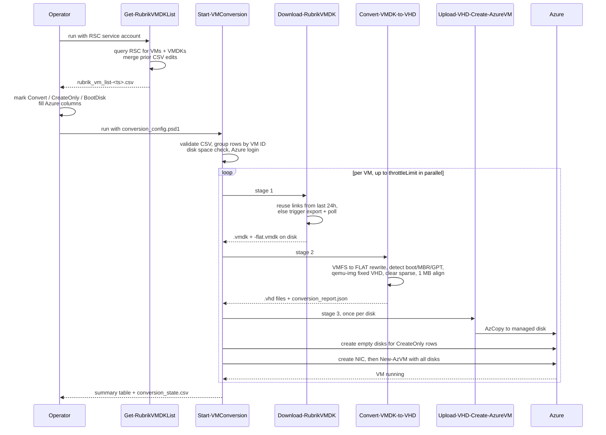

# Phase 1 - VMware to Azure Conversion

Takes VMDKs from a Rubrik snapshot and produces a running Azure VM with all
disks attached.

## Sequence



## Step 1 - Generate the CSV

```powershell
./Get-RubrikVMDKList.ps1 -RscServiceAccountJson './rsc-service-account.json'
```

Useful options:

```powershell
# Only VMs with snapshots on one cluster
./Get-RubrikVMDKList.ps1 -RscServiceAccountJson './rsc.json' -RecoveryCluster 'vault-r-madison'

# Fresh CSV, discard prior edits
./Get-RubrikVMDKList.ps1 -RscServiceAccountJson './rsc.json' -SkipMerge
```

Output is `./rubrik_vm_list-<yyyy-MM-dd_HHmm>.csv`, one row per VMDK, covering
both primary and replica objects. Only VMs with at least one snapshot appear.

On re-run it finds the newest CSV matching the prefix and merges your edited
columns forward, keyed on `vmdkFile` + `Cluster`.

## Step 2 - Fill in the CSV

Per **VMDK row**, choose an action:

| Goal | Mark |
|---|---|
| Transfer this disk's data to Azure | `Convert` = `x` |
| Create an empty disk of the same size, repopulate later via Phase 3 | `CreateOnly` = `x` |
| Ignore this disk | leave both blank |

Per **VM**, mark exactly one row `BootDisk` = `x`. That row is also where the
per-VM Azure settings are read from, so fill these on the boot disk row:

`ResourceGroup`, `VNetRG`, `VNetName`, `SubnetName`, `VMSize` are required.
`NsgRG`, `NsgName`, `ManagedDiskSku`, `tgtVMName` are optional.

Optionally set `DiskSuffix` per row to control managed disk names. Final name is
`{tgtVMName}-{DiskSuffix}`.

Full column detail is in [04-csv-reference.md](04-csv-reference.md).

## Step 3 - Configure the pipeline

Edit `conversion_config.psd1`:

```powershell
@{
    RscServiceAccountJson = './rsc-service-account-rr.json'
    workingDir            = 'F:\conversions'
    throttleLimit         = 5
    aria2cPath            = 'F:\aria2\aria2c.exe'
    qemuPath              = 'C:\Program Files\qemu\qemu-img.exe'
    azcopyPath            = 'F:\azcopy\azcopy.exe'
    timeoutMinutes        = 60

    RunDownload = $true
    RunConvert  = $true
    RunUpload   = $true

    subscription = 'RR-PRD'
    location     = 'eastus2'
    osType       = 'Windows'
    skuName      = 'StandardSSD_LRS'

    useStorageAccount    = $false
    storageAccountName   = 'rrtonglighthouse101'
    storageContainerName = 'vhds'
    storageAccountRG     = 'rr-tong'
}
```

`vmCsvFile` is commented out in the shipped config. Either uncomment it or pass
`-vmCsvFile` on the command line.

Command-line parameters override config file values.

## Step 4 - Run

```powershell
./Start-VMConversion.ps1 -pipelineConfig './conversion_config.psd1' `
  -vmCsvFile './rubrik_vm_list-2026-08-18_1317.csv'
```

Common variants:

```powershell
# Test download and convert without touching Azure
./Start-VMConversion.ps1 -pipelineConfig './conversion_config.psd1' -RunUpload $false

# Reduce parallelism
./Start-VMConversion.ps1 -pipelineConfig './conversion_config.psd1' -throttleLimit 2

# Retry VMs that failed on a prior run
./Start-VMConversion.ps1 -pipelineConfig './conversion_config.psd1' -RetryFailed
```

## Pre-flight checks the orchestrator runs

Before any work starts:

1. PowerShell 7+ present
2. RSC JSON, CSV, aria2c, qemu-img, azcopy all exist (only the tools for enabled stages)
3. No row has both `Convert` and `CreateOnly`. **Hard error.**
4. No `CreateOnly` row is also `BootDisk`. **Hard error.**
5. At least one actionable row exists
6. Disk space summary vs estimated need. Warning only.
7. Per-VM required Azure columns present. **Hard error** listing each VM.
8. `Connect-AzAccount` against the configured subscription

## What each stage does

### Stage 1 - Download

Two paths. It first looks for a successful Recovery event on this VM in the
**last 24 hours** and scrapes download links out of the event messages. If every
requested VMDK is covered, it reuses those links and skips the export entirely.

Otherwise it fires `downloadVsphereVirtualMachineFiles`, waits 15 seconds, finds
the matching recovery event, and polls every 60 seconds until SUCCESS. Then it
opens a CDM session against the cluster and pulls each URL with aria2c.

Both the `.vmdk` descriptor and the `-flat.vmdk` data file land in
`<vmDir>\download\`.

**Timeout behavior worth knowing:** `timeoutMinutes` (default 60) applies **only
to the export preparation poll**, not to the transfer. The transfer has no wall
clock limit. Instead it polls file size every 30 seconds, and if the size is
unchanged for 3 consecutive polls (90 seconds) it kills aria2c, deletes the
partial file, and restarts. Up to 3 attempts per URL. A non-zero aria2c exit
code is **not** retried; only stalls are.

### Stage 2 - Convert

For each `.vmdk` descriptor found in the download directory:

1. **Rewrite the descriptor in place.** Every `RW <n> VMFS` extent line becomes
   `RW <n> FLAT`. qemu-img cannot read the VMFS extent type Rubrik exports.
   Note this mutates the downloaded descriptor file, it is not a copy.
2. **Detect partition style and boot disk** by reading the first 2048 bytes of
   the flat file. `EFI PART` at offset 512 means GPT, then it scans the first 8
   GPT entries for the EFI System Partition type GUID. Otherwise a `0x55AA`
   signature at 510 means MBR, then it checks the four primary entries for the
   `0x80` active flag. Either match sets `isBootDisk`.
3. **Size gate.** Virtual size is summed from the descriptor's `RW <sectors>`
   lines times 512. Anything over 2 TiB is skipped with a warning and gets no
   report entry.
4. **Convert:** `qemu-img convert -f vmdk -O vpc -o subformat=fixed`
5. **Clear the NTFS sparse flag** with `fsutil sparse setflag <file> 0`. Windows
   can mark the qemu output sparse, which breaks the fully-allocated guarantee
   Azure requires.
6. **Align to 1 MB** with `Resize-VHD` if the file is not already a whole
   multiple of 1 MiB. Azure rejects unaligned VHDs on direct upload.

Writes `conversion_report.json`, an array of successfully converted disks:

```json
[
  {
    "sourceFile": "vmname.vmdk",
    "targetFile": "vmname.vhd",
    "partitionStyle": "GPT",
    "isBootDisk": true,
    "virtualSizeBytes": 96636764160
  }
]
```

Skipped and failed disks produce no entry. When exactly one disk converts,
PowerShell emits a bare object rather than an array.

### Stage 3 - Upload and VM creation

1. Read `conversion_report.json` to find the boot disk and derive Hyper-V
   generation: MBR gives `V1`, GPT gives `V2`. Falls back to the CSV `BootDisk`
   marking, then to the first converted file with a warning.
2. Upload the boot disk as a managed disk named `{tgtVMName}-{DiskSuffix}`.
3. Upload each remaining VHD as a data disk.
4. Create empty managed disks for every `CreateOnly` row, sized from
   `vmdkSizeGiB` rounded up.
5. Get the VNet, subnet and NSG. Create NIC `{tgtVMName}-nic-01` with
   accelerated networking.
6. Build the VM config and call `New-AzVM` **once** with every disk attached.
   Data disks get sequential LUNs starting at 0.
7. Poll power state up to 5 minutes for `VM running`.

## Resume, retry and idempotency

State lives in `<workingDir>\conversion_state.csv`, one row per VM keyed on the
RSC VM FID, with independent `DownloadStatus`, `ConvertStatus` and
`UploadStatus` columns.

| Prior state | Behavior on re-run |
|---|---|
| All three stages `Complete` | Skipped entirely |
| `Stage` = `Failed` | Skipped unless `-RetryFailed` |
| Anything else | Resumes, running only the incomplete stages |

Azure resources are reused rather than recreated when they already exist with
the expected name and `ProvisioningState` of `Succeeded`: managed disks, the
NIC, and the VM itself. If the target VM already exists and is running, the
upload stage is marked complete and skipped.

If the VM name is already taken in the resource group, the orchestrator prefixes
it with `az-` and continues.

A `Partial` result means the pipeline finished without error but one or more
stages were switched off via `RunDownload` / `RunConvert` / `RunUpload`.

## Outputs

| File | Contents |
|---|---|
| `<workingDir>\conversion_state.csv` | Per-VM stage status, Azure VM name, Hyper-V gen, error stage and message |
| `<workingDir>\logs\conversion_master-<ts>.log` | Full orchestrator transcript |
| `<workingDir>\logs\conversion_stats.csv` | Appended per VM: per-stage minutes, total GiB, status |
| `<workingDir>\<VMName>\conversion.log` | Per-VM transcript, where you look when a VM fails |
| `<workingDir>\<VMName>\conversion_report.json` | Boot disk and partition style detection results |

## Troubleshooting

| Symptom | Likely cause |
|---|---|
| `Resize-VHD` not recognized | Hyper-V management tools installed but not the full role |
| Disk skipped, over 2 TB | VHD format limit. No workaround in this toolkit. |
| Download times out at 60 min | Export preparation is slow on the cluster. Raise `timeoutMinutes`. |
| Download restarts repeatedly | Stall detector firing. Check network throughput to the cluster. |
| aria2c exits non-zero and stops | Exit-code failures are not retried. Check the per-VM log, then re-run the VM. |
| No boot disk identified | Partition signature not recognized. It falls back to the CSV `BootDisk` marking, so make sure that is set. |
| VM created but will not boot | Check Hyper-V generation. GPT source needs `V2`, MBR needs `V1`. Recorded in `conversion_state.csv`. |
| Direct upload fails | Set `useStorageAccount = $true` and configure the storage account keys. |
| Upload errors on alignment | The VHD virtual size is not a 1 MiB multiple. Check that the `Resize-VHD` step ran. |
