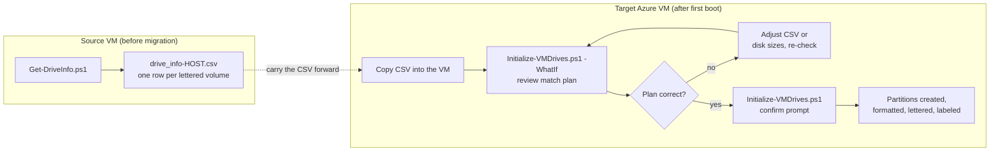

# Phase 2 - In-Guest Drive Rebuild

Recreates the source VM's drive letters, volume labels, file systems and
allocation unit sizes on the raw disks attached to the recovered Azure VM.

This matters because `CreateOnly` disks arrive in Azure as raw, uninitialized
managed disks. Without this step they are unformatted and have no drive letters,
so the Phase 3 restore has nowhere to land.

## Timing is critical

`Get-DriveInfo.ps1` must run on the **source VM while it is still running**,
before migration. There is no way to recover this information afterwards from
the Azure side, because the raw disks carry no partition table.



## Step 1 - Capture on the source VM

Run in an elevated PowerShell session on the source Windows VM:

```powershell
./Get-DriveInfo.ps1
```

Produces `./drive_info-<COMPUTERNAME>.csv`, one row per volume that has a drive
letter, and prints a table plus any warnings.

```powershell
# Custom output path
./Get-DriveInfo.ps1 -OutputPath 'C:\temp\drives.csv'
```

**Save this CSV somewhere outside the VM.** You need it after the VM is gone.

### Read the warnings before you migrate

| Warning | Meaning | What to do |
|---|---|---|
| Dynamic disk detected | Volume sits on an LDM dynamic disk | `Initialize-VMDrives.ps1` will skip it. Plan manual configuration. |
| Multi-partition disk detected | Several lettered volumes share one physical disk | Handled automatically, but verify partition sizes on the target. |
| Mount point volume detected | Volume mounted to a folder path with no drive letter | **Never written to the CSV.** Fully manual after migration. |

## Step 2 - Apply on the target Azure VM

After the Azure VM boots, copy the CSV in and run from an elevated session.

**Always preview first:**

```powershell
./Initialize-VMDrives.ps1 -CsvFile '.\drive_info-SQLSERVER01.csv' -WhatIf
```

`-WhatIf` prints the match plan and exits without touching a disk.

Then run for real:

```powershell
./Initialize-VMDrives.ps1 -CsvFile '.\drive_info-SQLSERVER01.csv'
```

Other options:

```powershell
# CSV holds several servers
./Initialize-VMDrives.ps1 -CsvFile '.\drives.csv' -ServerName 'SQLSERVER01'

# Unattended
./Initialize-VMDrives.ps1 -CsvFile '.\drives.csv' -SkipConfirmation

# Custom log
./Initialize-VMDrives.ps1 -CsvFile '.\drives.csv' -LogFile 'C:\temp\init.log'
```

The confirmation prompt states how many volumes on how many disks will be
formatted and warns it cannot be undone. Any response starting with `y` or `Y`
proceeds.

## How disks are matched - read this

Matching is **by size only**. There is no LUN, SCSI target or disk number
correlation, even though the CSV carries `BusType` and `ScsiTarget`.

1. **Candidate pool** is every disk where `PartitionStyle -eq 'RAW'`. A disk
   that is already initialized, even if empty, is invisible to the matcher.
2. **Tolerance is 10 percent** of the CSV target size, in either direction.
   Among all disks inside tolerance, the smallest absolute difference wins. This
   absorbs Azure's fixed disk tiers, since a 500 GiB source volume lands on a
   512 GiB managed disk.
3. **Largest first, greedy.** Multi-partition groups are matched first, ordered
   by summed capacity descending, then single-partition rows by capacity
   descending. Each raw disk is consumed once.
4. **Target size used:** for a single-partition row it is `TotalCapacityMB`. For
   a multi-partition group it is `DiskSizeGB` x 1024 when available, otherwise
   the summed volume capacity plus 5 percent.

### Same-size disks are ambiguous

If two raw disks are the same size, which one gets which drive letter is
effectively arbitrary, determined by CSV row order. The script detects this and
prints:

> WARNING: Multiple raw disks of the same size. Drive letter assignment for
> same-size disks is based on CSV order and may be interchangeable.

This is harmless for empty disks being formatted from scratch, because the
contents are created after the fact. It does mean the disk-number to
drive-letter mapping is not reproducible run to run.

## Multi-partition disks

Rows are grouped by the source `DiskNumber`. Within a group:

- Partitions are created **largest first**
- Every partition except the last is sized to its source volume capacity
- The **smallest** volume in the group is created last with `-UseMaximumSize`,
  absorbing any leftover space

One consequence to be aware of: the **partition style for the whole physical
disk is taken from the group's first CSV row** in file order, not from each row.
If rows in a group disagree on `PartitionStyle`, the first one wins.

File system and allocation unit size are applied per row, so volumes on the same
disk can differ there.

## What gets skipped

| Skipped | Rule |
|---|---|
| Existing drive letters | The letter already exists on the target. This is what makes the script safe to re-run. |
| Dynamic disks | `DiskType` is `Dynamic`. Cannot be recreated with `Initialize-Disk` / `New-Partition`. |
| Empty `Drive` cell | Silently skipped. |

**The boot drive is not explicitly excluded.** `IsBoot` and `IsSystem` are never
read by this script. `C:` is skipped only incidentally, because it already
exists on the target and hits the existing-letter filter. If a CSV row's letter
happened not to exist on the target, the script would try to create it
regardless of the `IsBoot` flag.

## Defaults when CSV values are missing

| Property | Default | CSV column |
|---|---|---|
| File system | `NTFS` | `FileSystem` |
| Allocation unit | 4096 bytes | `AllocationUnitSizeKB` x 1024 |
| Partition style | `GPT` | `PartitionStyle` |
| Volume label | none, always taken verbatim | `DriveType` |

Required columns are `Drive`, `TotalCapacityMB` and `DriveType`. The script
exits if any is absent. `DiskNumber`, `DiskType`, `DiskSizeGB` are optional and
enable multi-partition grouping and dynamic disk skipping when present.

## The match plan table

Printed before any change, under `=== Drive Initialization Plan ===`:

| Column | Meaning |
|---|---|
| `Drive` | Target drive letter |
| `Label` | Volume label to apply |
| `Vol Size` | Source volume capacity from the CSV |
| `Disk #` | **Target** raw disk number chosen by the matcher |
| `Disk Size` | Actual size of the matched raw disk |
| `FS` | File system to format with |
| `Alloc Unit` | Allocation unit size |
| `Partition` | Partition style to initialize with |
| `Multi` | `Y` when the disk holds multiple volumes |

Unmatched rows are listed separately as
`Drive X: N MB (label) -- no raw disk of similar size`.

## Verification after the run

The summary block reports volumes processed, successful, failed, skipped as
existing, skipped as dynamic, and unmatched. Note that "Volumes processed" is
the plan count, so skipped and unmatched rows are not included in it.

Then confirm manually:

```powershell
Get-Volume | Sort-Object DriveLetter | Format-Table DriveLetter, FileSystemLabel, FileSystem, Size, SizeRemaining
Get-Disk | Format-Table Number, PartitionStyle, Size, OperationalStatus
```

Cross-check drive letters and labels against the source CSV before moving to
Phase 3. Errors are per-drive, so one failure does not abort the rest.

The log file is appended to, never truncated, so re-runs accumulate history.

## Troubleshooting

| Symptom | Cause and fix |
|---|---|
| `No raw disks found` | Disks are already initialized, or `CreateOnly` disks were never attached. Check `Get-Disk`. |
| `no raw disk of similar size` | Size differs by more than 10 percent. Verify the Azure disk was created at the size from `vmdkSizeGiB`. |
| Wrong letters on same-size disks | Expected. Reassign manually with `Set-Partition -NewDriveLetter`. |
| Drive skipped as already existing | Correct behavior on a re-run. Delete the volume first if you genuinely want it recreated. |
| Dynamic disk skipped | Recreate the spanned or striped set manually in Disk Management. |
| CSV has multiple servers error | Pass `-ServerName`. |
| Partition style wrong on a multi-partition disk | The group's first CSV row set it. Reorder the CSV rows or fix the value. |
