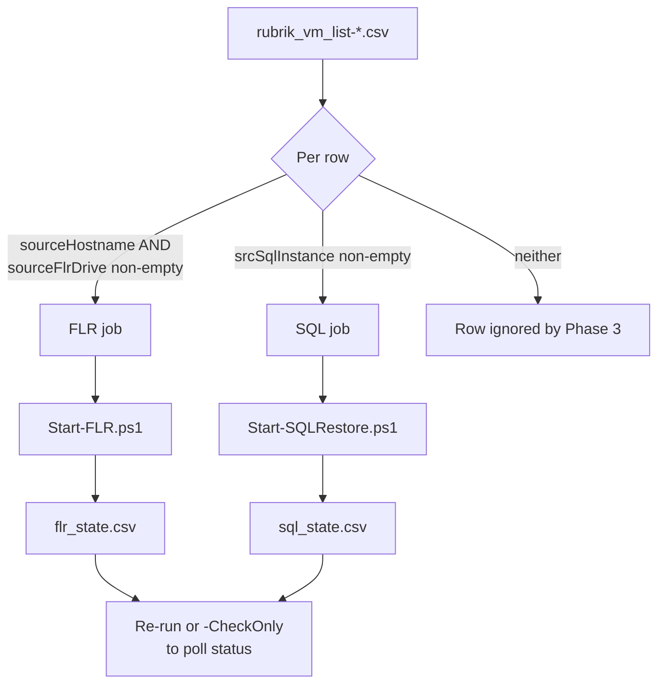

# Phase 3 - Data Recovery (FLR and SQL)

With the Azure VM running and its drives initialized, restore application data
from Rubrik. Two independent paths, both driven off the **same** VM list CSV.

## Which path runs is decided by CSV columns



A row can populate both a FLR job and a SQL job. The two scripts are independent
and can run in either order.

Both scripts are **fire and forget**. They initiate the job, record the async
request ID, and exit. Run again, or with `-CheckOnly`, to poll status.

Both share the same job key: `sourceHostname|targetHost`, where `targetHost` is
`targetRbsWinHost` falling back to `tgtVMName`.

## Common prerequisite

The target Windows host must have Rubrik Backup Service installed and be
registered on the **same Rubrik cluster as the source**. Both scripts constrain
the target lookup to the source's cluster ID.

---

# Path A - File-Level Recovery

Restores files from a Windows **volume group** backup of the source host onto
the recovered Azure VM.

## CSV columns

| Column | Required | Behavior |
|---|---|---|
| `sourceHostname` | Yes | Source Windows host in Rubrik holding the volume group backup. |
| `sourceFlrDrive` | Yes | Source drive letter(s). Comma separated for multiple, e.g. `G,H`. Trailing colons are stripped. |
| `Cluster` | Yes in practice | Matched client side. A blank value fails the host lookup. |
| `targetRbsWinHost` | No | Target host. Defaults to `tgtVMName`. |
| `targetFlrDrive` | No | Target letter(s), positionally mapped. Count must match `sourceFlrDrive` or the row is skipped. Blank restores to the same letter. |

Rows sharing a job key are merged, and drive mappings are deduplicated **by
source letter**. The first mapping for a given source drive wins, so a
conflicting target letter on a later row is silently dropped.

## Run it

```powershell
./Start-FLR.ps1 -RscServiceAccountJson './rsc-service-account.json' `
  -vmCsvFile './rubrik_vm_list-2026-08-18_1317.csv' `
  -workingDir './flr_work'
```

```powershell
# Poll status only, start nothing new
./Start-FLR.ps1 ... -CheckOnly

# Reset failed jobs to Pending and re-initiate
./Start-FLR.ps1 ... -RetryFailed
```

The status-check pass **always runs**, regardless of `-CheckOnly`. `-CheckOnly`
only suppresses initiation.

## What it actually does

1. Look up the source host: `physicalHosts(hostRoot: WINDOWS_HOST_ROOT)`,
   matched exactly on name **and** cluster name. It must have at least one
   volume group.
2. Get volume group snapshots over the **last 90 days**, grouped by day.
3. **Pick the snapshot** by sorting all snapshots across all volume groups on
   the day-group end timestamp, descending, and taking the first.
4. Browse the snapshot root to validate each requested drive letter exists.
   A missing letter is a yellow warning and that drive is dropped. All drives
   missing is a job failure.
5. For each valid drive, browse `/<SRC>:` **one level deep**, paginated, and
   build one restore config per top-level entry.
6. Look up the target host on the same cluster. Connectivity other than
   `CONNECTED` is a warning, not a failure.
7. Fire `restoreVolumeGroupSnapshotFiles` with `shouldIgnoreError = true`.

### What lands where

Every top-level item of a source drive is restored to the **root of the target
drive**. So with `sourceFlrDrive` = `C` and `targetFlrDrive` = `D`:

```
source C:\Data\file.txt   ->   target D:\Data\file.txt
```

The top-level name is preserved under the target root; the source drive letter's
own path component is dropped. Directory recursion is handled by the Rubrik
restore engine, not enumerated by the script.

`shouldIgnoreError = true` means individual file failures do not abort the
restore. That is what makes `PartialSuccess` reachable.

### Snapshot selection caveats

Selection is by **day bucket**, not exact snapshot time. If several snapshots
fall in the same day, the tie resolves to whatever order the API returned.
`isIndexed`, `isUnindexable` and `isQuarantined` are queried but never used to
filter, so an unindexed snapshot can be selected.

## `flr_state.csv`

Written to `<workingDir>\flr_state.csv`.

| Column | Notes |
|---|---|
| `JobKey` | `sourceHostname\|targetHost`, the primary key |
| `SourceHostname`, `TargetHost`, `Cluster` | From the CSV |
| `Drives` | Rendered as `G->G, H->J`. Refreshed from the CSV every run. |
| `Status` | See below |
| `AsyncRequestId` | Returned by the mutation. Recorded but **not used** for status correlation. |
| `SourceHostFid` | What status polling actually matches on |
| `SnapshotId` | The snapshot chosen |
| `ItemCount` | Number of restore configs submitted |
| `StartTime`, `LastChecked` | `yyyy-MM-dd HH:mm:ss` |
| `LastMessage`, `ErrorMessage` | Latest event message and failure detail |

**Status values:** `Pending`, `Initiated`, `Success`, `PartialSuccess`, `Failed`.

| From | Trigger | To |
|---|---|---|
| new key | first run | `Pending` |
| `Pending` | mutation succeeds | `Initiated` |
| `Pending` | any exception | `Failed` |
| `Initiated` | event status `Success` | `Success` |
| `Initiated` | event status `PARTIAL_SUCCESS` | `PartialSuccess` |
| `Initiated` | event status `TaskFailed`/`Failure`/`Failed` | `Failed` |
| `Failed` | `-RetryFailed` | `Pending` |

`Success`, `PartialSuccess` and `Failed` are sticky. Jobs dropped from the CSV
keep their state untouched.

### Status polling

Queries `activitySeriesConnection` filtered on `lastActivityType = Recovery` and
`objectFid = SourceHostFid`, takes the newest event.

Two things to be aware of:

- Correlation is on the **source host FID**, not the async request ID. If more
  than one recovery runs against the same source host, the status shown may
  belong to a different job.
- `lastUpdatedTimeGt` is passed `StartTime` in **local** time format, while
  `Start-SQLRestore.ps1` correctly uses ISO-8601 UTC. On a non-UTC host this can
  skew the event window.

---

# Path B - MSSQL Bulk Export

Exports **all** databases from a source SQL instance to a target SQL instance.

## CSV columns

| Column | Required | Behavior |
|---|---|---|
| `srcSqlInstance` | Yes | The only column that gates a row into the job list. |
| `sqlDataPath` | Yes | Target path for data files, e.g. `E:\SQLData`. |
| `sqlLogPath` | Yes | Target path for log files, e.g. `F:\SQLLogs`. |
| `sourceHostname` | Yes in practice | Used in the job key and the host lookup. |
| `Cluster` | Yes in practice | Matched client side. |
| `tgtSqlInstance` | No | Defaults to `srcSqlInstance`. |
| `targetRbsWinHost` | No | Defaults to `tgtVMName`. |

A row missing `sqlDataPath` or `sqlLogPath` is **skipped with a warning**, not a
hard error. Watch for that message.

**Dedup is first-row-wins.** Unlike FLR, only the first row for a given
`sourceHostname|targetHost` contributes settings. Keep SQL configuration on one
row per server pair.

## Run it

```powershell
./Start-SQLRestore.ps1 -RscServiceAccountJson './rsc-service-account.json' `
  -vmCsvFile './rubrik_vm_list-2026-08-18_1317.csv' `
  -workingDir './sql_work'
```

```powershell
./Start-SQLRestore.ps1 ... -CheckOnly
./Start-SQLRestore.ps1 ... -RetryFailed
```

## What it actually does

Four lookups, all matched client side on exact name:

1. Source host via `mssqlTopLevelDescendants(typeFilter: [MSSQL_HOST])`,
   matched on name and cluster name
2. Source instance under that host, giving `SrcInstanceFid`
3. Target host, scoped to the source's cluster ID. Target type filter is
   `PhysicalHost` and `WindowsCluster`, so a Windows failover cluster is a valid
   target.
4. Target instance under that host, giving `TgtInstanceFid`

Then fires `bulkExportMssqlDatabases` with:

```
finishRecovery     = true
recoveryPoint      = { timestampMs: <now, epoch ms> }
sourceInstanceIds  = [ SrcInstanceFid ]
allowOverwrite     = false
targetDataFilePath = sqlDataPath
targetLogFilePath  = sqlLogPath
targetInstanceId   = TgtInstanceFid
```

### Behavior worth knowing

| Setting | Consequence |
|---|---|
| `recoveryPoint` = now | There is no snapshot lookup. Rubrik interprets "now" as the latest recoverable point per database, log-tail inclusive. You cannot target an earlier point without editing the script. |
| `sourceInstanceIds` is the **instance** FID | **All** databases on the instance are exported. There is no per-database selection. |
| `allowOverwrite = false` | The export fails if the databases already exist on the target instance. Drop them first on a re-attempt. |
| `finishRecovery = true` | Databases come online rather than staying in a restoring state. |

Neither `sqlDataPath` nor `sqlLogPath` is validated for format or existence.
They pass through verbatim, so a malformed path surfaces later as an RSC or SQL
side failure in `ErrorMessage`.

## `sql_state.csv`

Written to `<workingDir>\sql_state.csv`.

| Column | Notes |
|---|---|
| `JobKey` | `sourceHostname\|targetHost` |
| `SourceHostname`, `TargetHost`, `Cluster` | From the CSV |
| `SrcInstance`, `TgtInstance`, `DataPath`, `LogPath` | Refreshed from the CSV each run |
| `Status` | See below |
| `AsyncRequestId` | Returned by the mutation |
| `SrcInstanceFid`, `TgtInstanceFid` | Resolved FIDs. Cleared by `-RetryFailed`. |
| `StartTime` | ISO-8601 UTC |
| `LastChecked` | Local `yyyy-MM-dd HH:mm:ss` |
| `LastMessage`, `ErrorMessage` | Latest event message and failure detail |

**Status values:** `Pending`, `Initiated`, `Success`, `Failed`. There is no
`PartialSuccess` on this path.

Status is aggregated by counting matching recovery events:

- Any failure count above zero sets the whole job to `Failed`, with
  `ErrorMessage` recording `Failed: N, Success: N, Running: N`. Some databases
  may still have restored successfully.
- Otherwise, any running count keeps it `Initiated`
- Otherwise `Success`, message `All N database(s) exported`

### Status polling caveat

The event query filters on `lastActivityType = Recovery` and
`objectType = Mssql` only. It is **not scoped to this job's instance FID**, and
it caps at 50 events. If several SQL exports run concurrently, one job's status
check will count another job's events. Treat aggregate status as advisory when
running more than one SQL job at a time, and confirm in the RSC activity log.

---

## Verification

For both paths, re-run with `-CheckOnly` until every job reaches a terminal
state, then verify in-guest:

```powershell
# FLR: spot check restored content
Get-ChildItem D:\ | Select-Object -First 20

# SQL: confirm databases are online
Invoke-Sqlcmd -Query "SELECT name, state_desc, recovery_model_desc FROM sys.databases"
```

Cross-check against the RSC activity log for the authoritative per-item result,
particularly for `PartialSuccess` on the FLR path and for any concurrent SQL
jobs.

## Troubleshooting

| Symptom | Cause and fix |
|---|---|
| `Source host not found on cluster ''` | `Cluster` is blank on the row. Fill it in. |
| `has no volume groups` | The source host has no volume group backup. FLR needs one, not a VM backup. |
| `No volume group snapshots found in the last 90 days` | Backups are older than the 90-day query window. |
| `No valid drive letters found in snapshot` | The letter in `sourceFlrDrive` is not present in the snapshot. Check the actual drive letters backed up. |
| `sourceFlrDrive has N drive(s) but targetFlrDrive has M` | Counts must match. Fix the row or blank `targetFlrDrive`. |
| SQL row silently absent from the job list | `sqlDataPath` or `sqlLogPath` is blank. Look for the skip warning. |
| SQL export fails immediately | `allowOverwrite = false` and the databases already exist on the target. |
| SQL job shows `Failed` but some databases restored | Aggregation fails the whole job on any failure. Check RSC for per-database results. |
| Target host not found | It is not registered on the same cluster as the source, or RBS is not installed. |
| Status never leaves `Initiated` | The event filter found nothing matching. Verify in the RSC activity log directly. |
